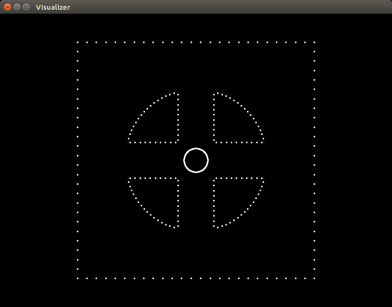

# LookingGlass
OpenGL C++ rendering utilities meant for visualizing scientific data
Especially useful for debugging scientific codes on the fly (immediate feedback)
- Tools to render points, lines, and triangles 
- Interact with the screen via mouse and keyboard hotkeys
- Build upon existing classes to create new capabilites

